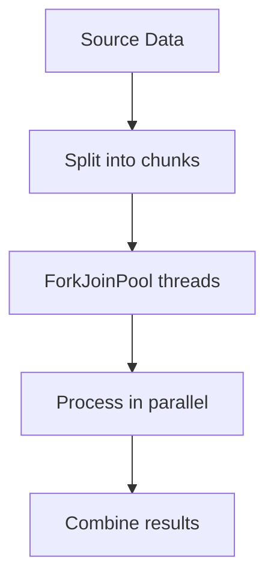

# Day 38 — Parallel Streams

Parallel streams allow Java to process stream operations
using multiple threads automatically.

---

## How Parallel Streams Work

- Uses **ForkJoinPool.commonPool**
- Splits data into chunks
- Processes chunks in parallel
- Merges results

---

## Sequential vs Parallel

```java
stream();          // single thread
parallelStream();  // multiple threads

```

---
## When to Use Parallel Streams

✅ Large datasets
✅ CPU-intensive operations
✅ Stateless, independent operations
✅ No shared mutable state

---
## When NOT to Use Parallel Streams

❌ Small collections
❌ I/O operations
❌ Order-sensitive logic
❌ Synchronized / blocking code

---
## Performance Reality

	Parallel ≠ Faster always.

		Overhead includes:
			- Thread management
			- Context switching
			- Task splitting & merging
---
## Execution Flow


---


