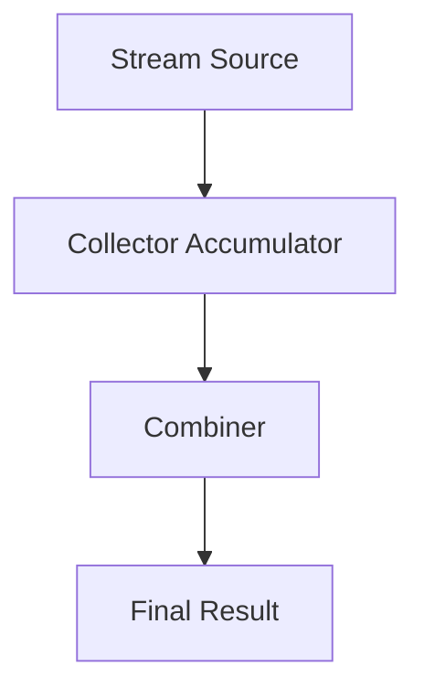

# Day 39 — Stream Collectors Deep Dive

Collectors transform a stream into a final result
like a List, Set, Map, or aggregated value.

---

## collect() Basics

```java
<R, A> R collect(Collector<? super T, A, R> collector)
```
---

## Collectors define:

	- How to accumulate 
	- How to combine 
    - How to finish 
	
---
## Common Collectors

| Collector        | Purpose              |
| ---------------- | -------------------- |
| toList()         | Collect into List    |
| toSet()          | Collect into Set     |
| toMap()          | Collect into Map     |
| groupingBy()     | Group elements       |
| partitioningBy() | Split by predicate   |
| mapping()        | Transform downstream |
| reducing()       | Aggregate values     |

---
## groupingBy vs partitioningBy

	- groupingBy → multiple keys 
	- partitioningBy → always two keys (true / false) 
---

## Collector Flow



---
## Best Practices

	- Prefer built-in collectors 
	- Avoid manual mutable reductions 
	- Use downstream collectors for clarity 
---

