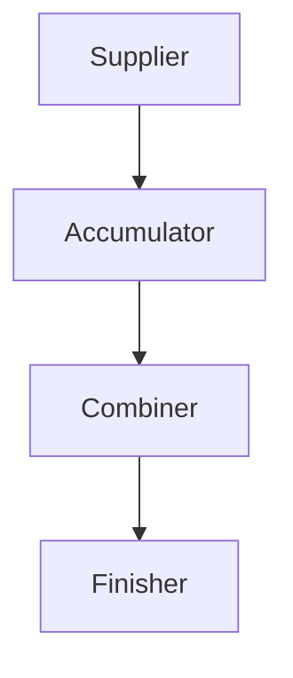

# Day 40 — Custom Collectors & Mutable Reduction

Collectors define how stream elements are accumulated
into a final result.

---

## What Is Mutable Reduction?

- Accumulating elements into a **mutable container**
- Container is updated during stream processing
- Used by collectors like:
  - toList()
  - toSet()
  - groupingBy()

---

## Built-in Mutable Reduction

```java
List<String> list =
    stream.collect(Collectors.toList());
```

---
## Internally:

	- List is mutable
	- Elements are added one by one
---
## Custom Collector Structure

	A custom collector has 4 parts:

		1. Supplier → creates container
		2. Accumulator → adds element
		3. Combiner → merges partial results
		4. Finisher → transforms result
---
## Collector Lifecycle


---
